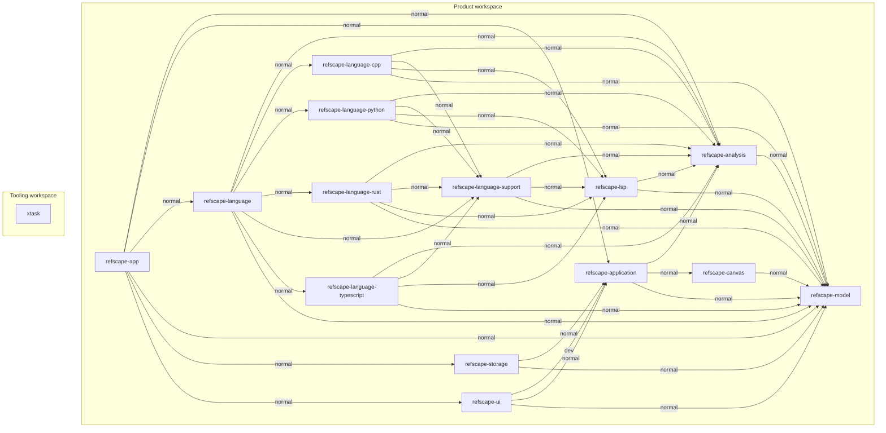
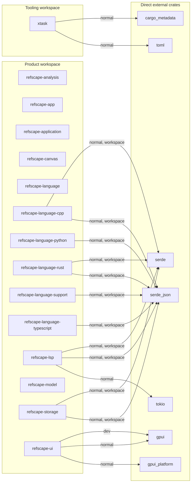

# Dependency graph

<!-- Generated by cargo xtask graph. Do not edit manually. -->

矢印は依存する crate から依存先へ向かう。

## Internal dependencies

製品の内部依存宣言を表示し、dev・build・optional・target 固有の依存も含む。
`xtask` は独立した workspace で、製品への依存を持たない。

## Direct external dependencies

各 crate の Cargo.toml に宣言された直接の外部依存を表示する。
推移依存は含めず、同じ package 名への依存は一つのノードにまとめる。
dev・build・optional・target 固有の宣言も含み、別名は `alias`、workspace 継承は `workspace` で示す。
`xtask` の外部依存は製品 workspace と分けて表示する。

