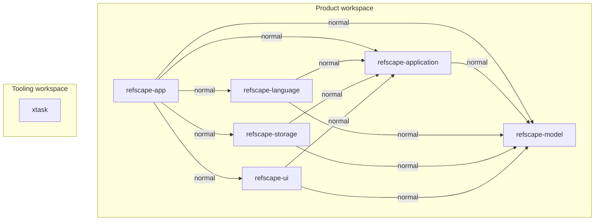

# Dependency graph

<!-- Generated by cargo xtask gate. Do not edit manually. -->

矢印は依存する crate から依存先へ向かう。製品の内部依存宣言を表示し、
dev・build・optional・target 固有の依存も含む。外部依存は省略する。
`xtask` は独立した workspace で、製品への依存を持たない。

